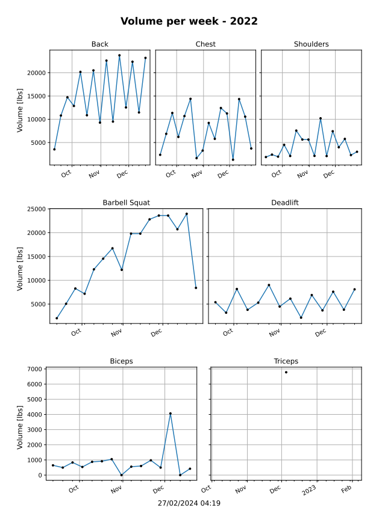

Script to process gym data logged with the Android FitNotes app.

Use Python, Pandas and Matplotlib to generate a PDF training report with graphs per muscular group:
- Volume per week
- Volume per month
- Max weight lifted

Example output:

